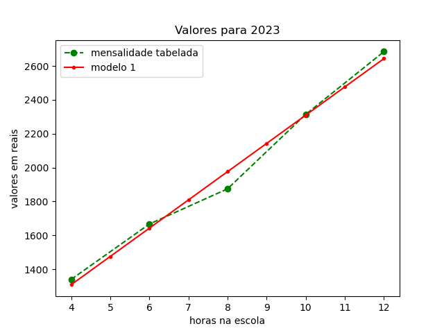
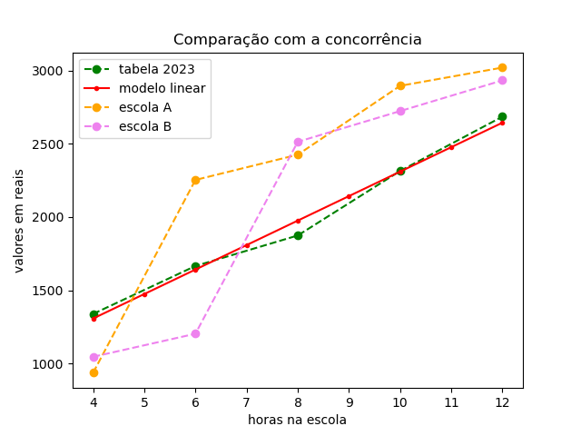

# Cálculo de mensalidades para uma escola de período integral
(repositório em construção...)

## Introdução

Uma escola em dificuldades financeiras solicitou um cálculo de mensalidades para serem praticadas no ano letivo de 2024. O cálculo deve cobrir os gastos e dar uma margem de lucro suficiente para possibilitar uma recuperação dos prejuízos financeiros do ano anterior.

## Objetivos

Propor uma tabela de mensalidades para o ano letivo de 2024. A tabela deve considerar:

- os valores pagos no ano anterior;
- os custos fixos e variáveis da escola;
- os valores praticados nas escolas da região;
- uma margem de lucro que possibilite uma recuperação financeira ao longo do ano dado o prejuízo do ano anterior.

O cálculo foi solicitado no início do mês de novembro, época em que a maioria das escola já está efetuando rematrículas para o ano seguinte. Dada a urgência da situação, todo o cálculo foi feito em apenas algunas dias.

# Dados

Os dados financeiros foram anonomizados usando um fator de conversão.
Os dados disponíveis para a análise foram:

- tabela de mensalidades proposta para o ano de 2023;
- valores de mensalidade efetivamente pagos em 2023;
- extratos bancários das contas da escola dos meses de junho a outubro (únicos meses disponíveis. Para mais detalhes, ver repositório: diagnostico-escola);
- valores praticados em 3 outras escolas da região;
  

  # Análise de dados

Fizemos uma pesquisa de mercado para conhecer os valores de mensalidade praticados na região da escola. Além disso, pesquisamos qual seria o percentual médio de reajuste de mensalidades para o ano de 2024. Esses dados, juntamente com os valores de mensalidades praticados em 2023, serviram de base para a elaboração de um modelo para as receitas da escola. A partir do modelo, criamos uma fórmula matemática capaz de calcular os valores de mensalidades em função das horas de permanência na escola.

A primeira dificuldade encontrada foi entender como as mensalidades estavam sendo calculadas anteriomente. A tabela vigente não estava sendo praticada. Praticamente todos os alunos da escola possuiam algum tipo de desconto. Os descontos previstos na tabela eram baseados em dois critérios que não serão citados para preservar a anonimidade, mas se dividiam em descontos de 15%, 18% e 5%, sendo o último um desconto pontualidade, cumulativo com os anteriores. Não havia informação se os descontos de 15 e 18% poderiam ser acumulados, apesar da possibilidade dos dois critérios serem atendidos simultaneamente.

Não havia registro formal dos descontos praticados e nenhuma comprovação de atendimento dos critérios para os tais descontos. Foi impossível relacionar cada aluno com os critérios de desconto a partir dos documentos arquivados na escola. Segue abaixo a comparação entre as mensalidades tabeladas sem desconto e as efetivamente praticadas no mês de agosto de 2023.

Para entender como a dispersão dos valores pagos se relaciona com os descontos dados, consideramos todas as combinações possíveis de descontos previstos. Como resultado, vemos abaixo um gráfico onde as linhas cheias delimitam uma região possível de dispersão das mensalidades. Mas nem isso é capaz de explicar os valores.

Comparando ponto a ponto, vemos que alguns descontos se enquadram nas curvas previstas, podendo ter pequenos arredondamentos. Para conferir os dados, questionamos alguns responsáveis financeiros se se enquadravam nos critérios de desconto e a resposta foi não. Concluímos que os descontos foram dados sem nenhum critério.

## Modelo matemático

Decidimos começar com um modelo linear baseado na tabela de 2023. Para isso, fizemos uma ajuste linear dos valores tabelados.

Como resultado, obtivemos que o valor da mensalidade pode ser descrita por um valor fixo de R$640,67 mais R$166,92 por hora de permanência. Adotando esses valores, a escola consegue cobrir as despesas e ter uma margem de lucro dentro da expectativa do dono.

Dado que os valores atendem as expectativas do empresário, precisamos pensar se atendem as expectativas dos possíveis clientes. Pesquisando escolas da região, notamos uma prática comum de dar desconto progressivos com o número de horas de permanência na escola. Além disso, notamos que o valor para 4 horas está longe da concorrência. Abaixo, a comparação com as escolas pesquisadas:

Decidimos construir um modelo não linear que preveja descontos progressivos com o número de horas de premanência na escola e que permita reduzir o valor para 4 horas sem comprometer o orçamento.
Considerando que os alunos passam, em média, 8 horas na escola estudada, decidimos suavizar a curva de mensalidades para mais de 8 horas de permanência. Assim, não comprometemos a renda e estimulamos a permanência por um tempo maior. Ao mesmo tempo, vamos tentar manter o modelo abaixo da concorrência.

continua...  ;)