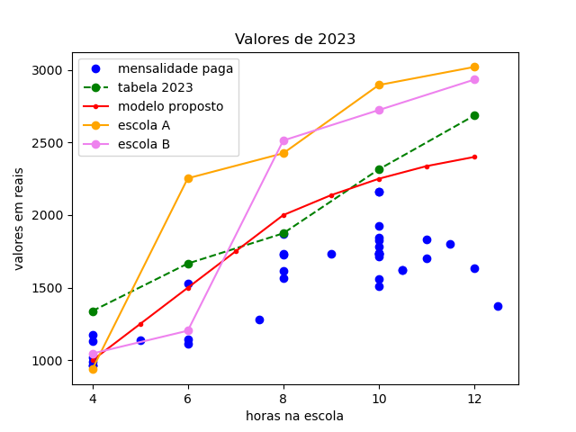
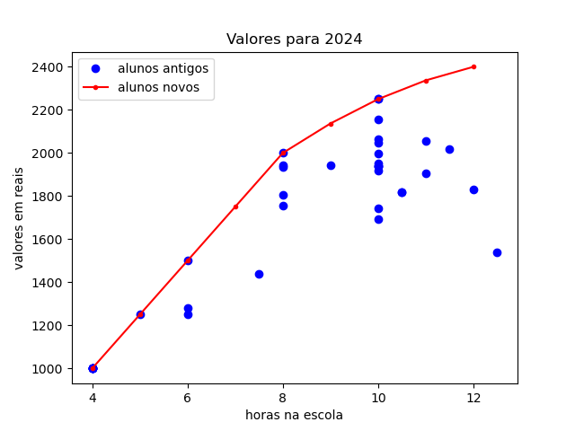

# Cálculo de mensalidades para uma escola de período integral

## Introdução

Uma escola em dificuldades financeiras solicitou um cálculo de mensalidades para serem praticadas no ano letivo de 2024. O cálculo deve cobrir os gastos e dar uma margem de lucro suficiente para possibilitar uma recuperação dos prejuízos financeiros do ano anterior.

## Objetivos

Propor uma tabela de mensalidades para o ano letivo de 2024. A tabela deve considerar:

- os valores pagos no ano anterior;
- os custos fixos e variáveis da escola;
- os valores praticados em escolas similares da região;
- uma margem de lucro que possibilite uma recuperação financeira ao longo do ano dado o prejuízo do ano anterior.

O cálculo foi solicitado no início do mês de novembro, época em que a maioria das escolas já está efetuando rematrículas para o ano seguinte. Dada a urgência da situação, toda a coleta de dados e os cálculos foram feitos em apenas alguns dias.

# Dados

Os dados financeiros foram anonimizados usando um fator de conversão.
Os dados disponíveis para a análise foram:

- tabela de mensalidades proposta para o ano de 2023;
- valores de mensalidade efetivamente pagos em 2023;
- extratos bancários das contas da escola dos meses de junho a outubro (únicos meses disponíveis. Para mais detalhes, veja: diagnostico-escola);
- valores praticados em 2 outras escolas da região;
  

  # Análise de dados

Fizemos uma pesquisa de mercado para conhecer os valores de mensalidade praticados na região da escola. Além disso, pesquisamos qual seria o percentual médio de reajuste de mensalidades para o ano de 2024. Esses dados, juntamente com os valores de mensalidades praticados em 2023, serviram de base para a elaboração de um modelo para as receitas da escola. A partir do modelo, criamos uma fórmula matemática capaz de calcular os valores de mensalidades em função das horas de permanência na escola.

A primeira dificuldade encontrada foi entender como as mensalidades estavam sendo calculadas anteriormente. A tabela vigente não estava sendo praticada. Praticamente todos os alunos da escola possuíam algum tipo de desconto. Os descontos previstos na tabela eram baseados em dois critérios que não serão citados para preservar a anonimidade, mas se dividiam em descontos de 15% e 18%. Além desses, havia também um desconto pontualidade cumulativo com os anteriores. Não havia informação se os descontos de 15% e 18% poderiam ser acumulados, apesar da possibilidade de os dois critérios serem atendidos simultaneamente.

Não havia registro formal dos descontos praticados e nenhuma comprovação de atendimento dos critérios para tais descontos. Foi impossível relacionar cada aluno com os critérios de desconto a partir dos documentos arquivados na escola. Segue abaixo a comparação entre as mensalidades tabeladas sem desconto e as efetivamente praticadas no mês de agosto de 2023.

Para entender como a dispersão dos valores pagos se relaciona com os descontos dados, consideramos todas as combinações possíveis de descontos previstos. Como resultado, vemos abaixo um gráfico onde as linhas cheias delimitam uma região possível de dispersão das mensalidades. Mas nem isso é capaz de explicar os valores.

Comparando ponto a ponto, vemos que alguns descontos se enquadram nas curvas previstas, podendo ter pequenos arredondamentos. Para conferir os dados, questionamos alguns responsáveis financeiros se eles se enquadravam nos critérios de desconto, mas a resposta foi negativa. Concluímos que os descontos foram dados sem nenhum critério.

## Modelo matemático

Decidimos começar com um modelo linear baseado na tabela de 2023. Para isso, fizemos uma ajuste linear dos valores tabelados.

Como resultado, obtivemos que o valor da mensalidade pode ser descrita por um valor fixo de R$640,67 mais R$166,92 por hora de permanência. Adotando esses valores, a escola conseguiria cobrir as despesas e ter uma margem de lucro dentro da expectativa do dono.

Dado que os valores atendem as expectativas do empresário, precisamos pensar se atendem as expectativas dos possíveis clientes. Pesquisando escolas da região, notamos uma prática comum de dar desconto progressivos com o número de horas de permanência na escola. Além disso, notamos que o valor para 4 horas está longe da concorrência. Abaixo, a comparação com as escolas pesquisadas:

Decidimos construir um modelo não linear que preveja descontos progressivos com o número de horas de permanência na escola e que permita reduzir o valor para 4 horas sem comprometer o orçamento.
Considerando que os alunos passam, em média, 8 horas na escola estudada, decidimos suavizar a curva de mensalidades para mais de 8 horas de permanência. Assim, não comprometemos a renda e estimulamos a permanência por um tempo maior. Ao mesmo tempo, vamos tentar manter o modelo abaixo da concorrência.

Para pensar no novo modelo, comparamos o valor médio cobrado por hora nas escolas e o valor para 4h de permanência, onde o modelo está mais discrepante. O valor médio foi calculado usando como referência a distribuição de alunos no mês de agosto.

| escola   |   por hora  | para 4h    |
| -------- | ----------- | ---------- |
|    A     |  R$ 285,88  | R$ 938,21  |
|    B     |  R$ 266,74  | R$ 1047,20 |
| modelo 1 |  R$ 242,77  | R$ 1308,26 |

Com base nos valores da tabela acima, decidimos adotar um modelo linear onde o valor da hora é de R$250 e dar desontos progressivos de 5, 10, 15 e 20% respectivamente para 9, 10, 11 e 12h de permanência na escola. O modelo resultou na curva vermelha mostrada abaixo.

A curva tem um ótimo potencial de lucro, resolve a discrepância no tempo de 4h e está bem abaixo da concorrência para os demais tempos. Porém, o aumento de mensalidade real para os alunos já matriculados, ultrapassa 12% em 70% dos casos. Em reunião com a direção da escola, foi decidido adotar o modelo proposto para alunos novos e praticar o aumento de no máximo 12% para os alunos antigos. Com isso, o reajuste para os alunos antigos fica no limite da curva do modelo proposto. O resultado está mostrado no gráfico abaixo.

Comparando a curva proposta pela MP para 2024 com a curva anterior para 2023 (gráfico abaixo), temos agora uma curva mais ajustada à concorrência no limite inferior e com práticas de descontos similares. De posse do modelo, podemos fazer algum ajuste percentual para levar em consideração o aumento de despesas para o ano seguinte (reajuste de salários, aluguel e serviços necessários para o funcionamento da escola).

Embora o potencial de lucro da curva de 2024 seja 6% menor que o da curva de 2023, a direção da escola decidiu por não aumentar os valores, já que a tabela 2023 nunca havia sido realmente utilizada.

# Conclusão

A MP-resuldados, juntamente com a direção da escola, decidiram adotar o modelo proposto para os alunos novos em 2024 e praticar o aumento de no máximo 12% para os alunos antigos. A diferença entre o valor pago pelos alunos antigos e a tabela nova passou a ser uma bolsa de estudos. O desconto pontualidade de 5% pode ser mantido sem comprometimento das despesas. Os valores para 2024 estão mostrados abaixo.

O ponto de equilíbrio financeiro da escola (calculado em detalhes no repositório diagnostico-escola) era de 41 alunos no ano de 2023. Depois de enfrentar diversos problemas, a escola chegou em novembro com apenas 33 alunos, acumulando um prejuízo financeiro.

Considerando somente o reajuste proposto de 12% para os 33 alunos antigos, a escola não seria capaz de suprir as despesas de 2024. Orientamos a escola para que direcionasse esforços na retenção dos alunos antigos e na captação de novos, para a geração de lucro. Considerando que a capacidade da escola é de 100 alunos e os preços são atraentes, a possibilidade de lucro é bastante satisfatória (se a nova tabela for seguida...).

Para orientar melhor uma tomada de decisão sobre o futuro da escola, calculamos uma previsão das despesas e receitas para 2024. Os detalhes se encontram no repositório viabilidade-de-negocio. 

-----------------------------------------------------------------------------
MP-resuldados

Dos dados aos resultados. Um pouco de física, matemática, negócios e finanças.

